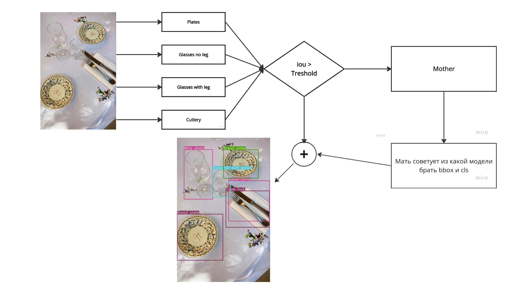

# AristoсratBot 

## Идея работы 
Создать сервис, который определяет разные виды бокалов,тарелок,столовых приборов 

## Список определяемых классов 
Добавь табличку с классами! 

## Что под капотом? 
[YOLOv8](https://github.com/ultralytics/ultralytics) - семейство моделей обнаружения объектов на базе YOLO от Ultralytics 
В данном проекте исспользована модель YOLOv8m, дообученная на 5 датасетах:
1. Mother - нейросеть, различающая метаклассы (тарелки, столовые приборы, бокалы с ножкой и без нее);
2. Plates - нейросеть, отвечающая за распознавание классов метакласса тарелки;
3. Glass no leg - нейросеть, отвечающая за распознавание классов метакласса бокалы без ножки;
4. Glass leg - нейросеть, отвечающая за распознавание классов метакласса бокалы с ножкой;
5. Cutlery - нейросеть, отвечающая за распознавание классов метакласса столовые приборы.

## Использование

## Над проектом работали 
[IvaElen](https://github.com/IvaElen) 
[GalkaMT](https://github.com/GalkaMT) 
[AlexeyPratsevityi](https://github.com/AlexeyPratsevityi) 

